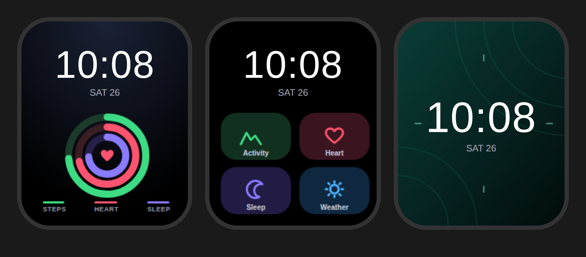

# Watch faces

Custom watch face backgrounds for the Noise Icon 2, in a Samsung One UI style. Each one is 240 × 286 px, which is believed to match the watch's screen. Check the size NoiseFit asks for on its custom face screen.

| File | Style | Time position |
|---|---|---|
| `onedark.png` | Activity rings (steps, heart, sleep) on dark blue | Top |
| `tiles.png` | One UI-style tile grid (Activity, Heart, Sleep, Weather) | Top |
| `jade.png` | Minimal dark green gradient with arcs | Middle |

The preview shows a sample time and date. On the watch, the watch draws its own time on top.

## Installing

1. Save the PNG to your phone.
2. In NoiseFit, open your device's **watch faces** section and choose **Custom** (or **DIY**), then pick the image.
3. Set the time position as shown in the table and the text colour to white, then tap **Install**.

The rings and tiles are part of the picture. They don't show live data, because Noise's custom faces only let you add a photo plus the watch's own time and date.

## Editing

`source.html` holds the SVG for all three faces. Open it in a browser to edit, or render new PNGs at 240 × 286 with any headless browser, for example a Playwright element screenshot of each `.face` element.

## Live faces

[`live/`](live/) has experimental faces in the MoYoung binary format with a real clock, steps, heart rate and battery. They're uploaded from a laptop instead of as a photo.
