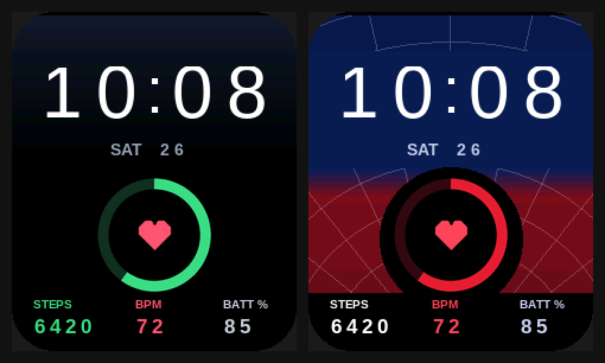

# Live watch faces (MoYoung binary format)

Real watch faces with **live data**, not just a background photo. They use the MoYoung / Da Fit v2 binary face format that the Noise Icon 2's firmware (`MOY-VRZ4-2.0.0`) appears to be built on.



| File | Shows |
|---|---|
| `onedark_live.bin` | Time, day and date, a live steps progress ring, steps, heart rate and battery %. Black and navy with Galaxy-style colours. |
| `web_live.bin` | The same layout on the navy, red and web background. |
| `tiny_test.bin` | A 4 KB test: blue, green and red blocks, no clock. 16 chunks, so an upload takes seconds and quickly shows whether the watch accepts faces at all. Built by `tiny.py`. |

The preview is rendered from the finished `.bin` files with sample values (10:08, SAT 26, 6420 steps, 72 bpm, 85%).

## Status: experimental

- These are built as **type C faces for a 240 × 286 screen** ("tpls 56" in [dawft](https://github.com/david47k/dawft)'s table), which matches the Icon 2's screen size. Noise doesn't publish its face format, so it's **not yet confirmed** that the Icon 2 accepts this format. Some newer MoYoung watches use a different "new" format instead ([extrathundertool](https://github.com/david47k/extrathundertool)).
- A watch face is data, not firmware. If the watch doesn't like the file, it should reject it or show a broken face, which you fix by picking another face in NoiseFit. That isn't guaranteed, though; the upload tools are community-made alpha software.
- The 0–100% ring fills against the step goal set in NoiseFit.

## Uploading (needs a laptop with Bluetooth)

Uploading uses [dawfu](https://github.com/david47k/dawfu) (Rust; Windows 10+, macOS, Linux) or [DaFup](https://github.com/VicGuy/DaFup) (Python, mainly Linux).

1. Charge the watch above 50%.
2. Free the watch: disconnect it in the phone's Bluetooth settings and force-stop NoiseFit. Turning phone Bluetooth off is easiest.
3. On the laptop:
   ```sh
   git clone https://github.com/david47k/dawfu && cd dawfu
   cargo run --release -- info                                  # should list the watch, manufacturer "MOYOUNG-V2"
   cargo run --release -- upload /path/to/onedark_live.bin
   ```
   If `info` shows a manufacturer other than `MOYOUNG-V2`, stop: the watch uses a different protocol.
4. When the upload finishes, dawfu switches the watch to the uploaded face (the "gallery" slot).
5. To undo it, pick any other face in NoiseFit.

## Rebuilding or editing

```sh
pip install pillow
python gen.py                       # writes onedark_live/ and web_live/ source folders (BMPs + watchface.txt)
dawft create folder=onedark_live onedark_live.bin
dawft dump folder=check onedark_live.bin && python sim.py check preview.png   # render what the watch should draw
```

`gen.py` holds the layout (element positions and colours) and the backgrounds. Each digit is drawn on the exact patch of background behind it, so there are no boxes, because the watch has no transparency.
